# Table of Contents
- [Introduction](#introduction)
- [Architecture Schema](#architecture-schema)
- [My application (JWT)](#application-jwt)
    - [Register an application](#register-application-named-customclaimprovider-app-jwt)
    - [Configuration](#configuration-of-this-application)
    - [Test](#test-your-application)
- [Logic Apss](#logic-app)
    - [Flow - Get manager](#flow---get-manager)
    - [Flow - ](#)
- [Custom Authenitcation Extensions](#custom-authentication-extensions-preview)
    - [User](#)
- [Go back to your app](#go-back-to-your-application)

- [Troubleshooting](#troubleshooting)

# Introduction
I often get question like *“How can I add some information as claim?”*, *“My informations are not in Entra ID, what should I do to include these information in my toekn?”*
This example can be use to address some scenarios like:
1. I need to have email of manager of user in his token. Based on this information, in my application I will be able to validate his access of this user is authorized or not.
2. I need to 

# Architecture schema

# Application JWT
To read the contain of token, you have different tools depending of type of token (Claims X-Ray, [JWT Decoder](https://adfshelp.microsoft.com/JwtDecoder/GetToken) or [JWT.io](https://jwt.io)) but in this example, I will use [jwt.ms](https://jwt.io).

The first step consist to create an application named **CustomClaimProvider-App-JWT**. With this application, I will be able to view the contain of my tokens.
I recommend to create it because each time you want to deploy an application, you should validate informations presented in the token. It will be helpful during your day-to-day.

## Register application named CustomClaimProvider-App-JWT
1. Define a name
2. Select Single Tenant. In most of case, you don't need a Multitenant app. To understand the difference and risk, [follow this link]().

    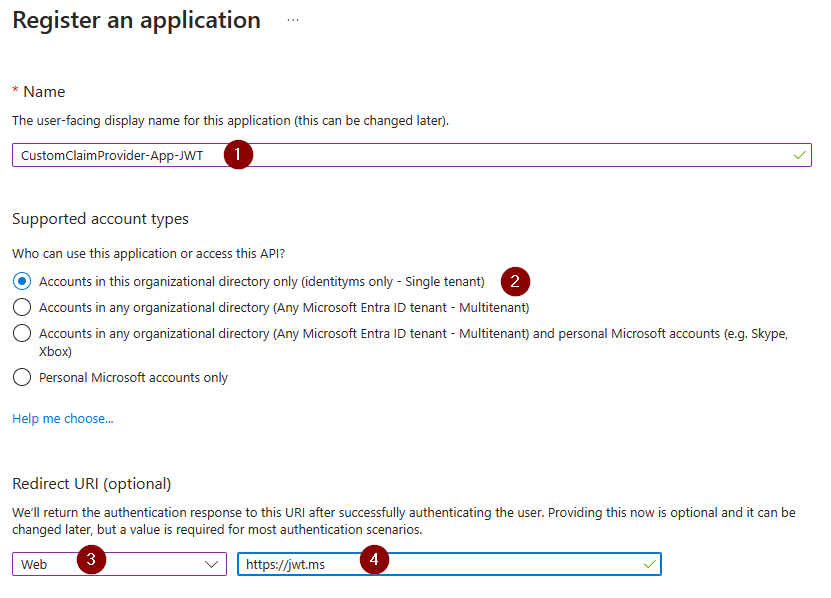

3. Select type of application: web
4. Define the URL of jwt.ms website.

## Configuration of this application
#### Blade Enterprise Application
1. Enable **Enabled for users to sign-in?**
2. Disable **Assignment required?**. Admins and developers will be able to use this application. If some users have some issues, you can ask them to use this application to see their claims and trouble shoot why they have an issue with your application.
3. Disable **Visible to users?** It's not necessary to offer this application through [myapplication](https://myapps.microsoft.com) portal.

    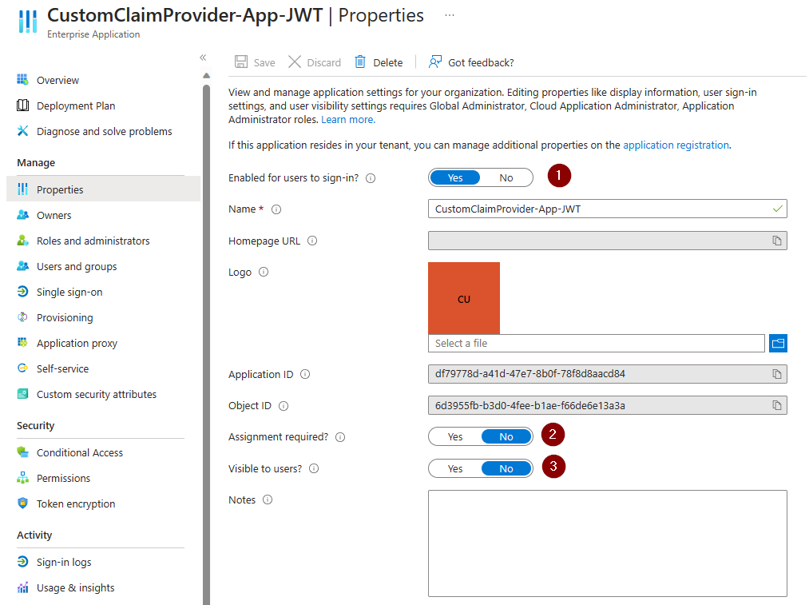

#### Blade App Registration
1. Select ID Tokens

    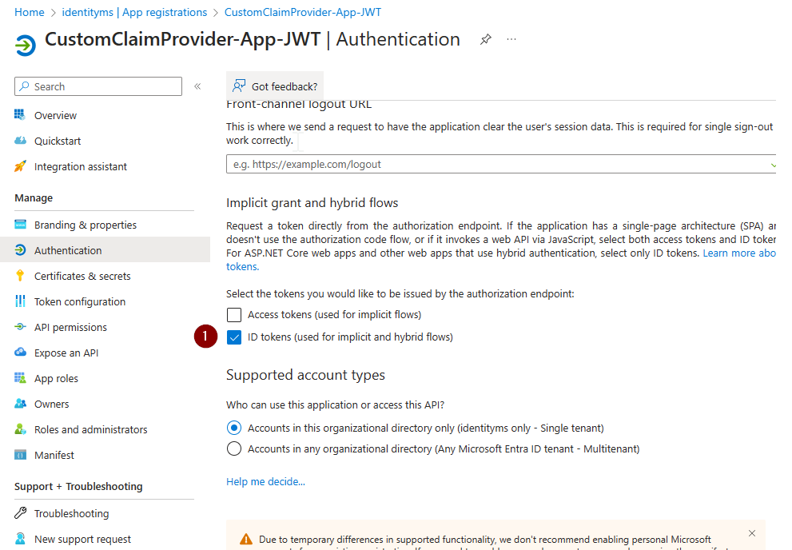

2. Manifest

    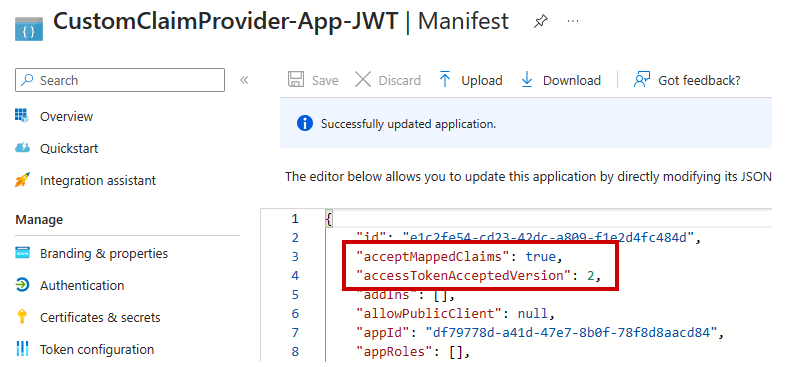

## Test your application
Before testing, you need to get some informations:
1. Client ID
2. Tenant ID

    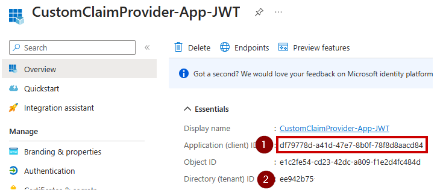

Then, replace values (*tenantid* and *clientid*) by your own values.
`https://login.microsoftonline.com/<tenantid>/oauth2/v2.0/authorize?client_id=<clientid>&redirect_uri=https%3A%2F%2Fjwt.ms%2F&scope=openid&nonce=defaultNonce&response_type=id_token`

Open a tab in your browser and paste the link. You should see your token decoded.

    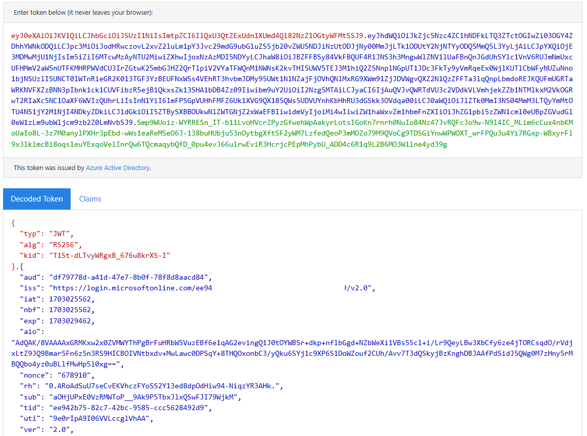

# Logic App
Before creating your Logic App, you have to decide which type you want to use. For cost perspective, in this example, I will use Consumption (less expensive).

## Flow - Get manager
Remember that in my scenario 1, I want to get manager of user and add it into the user token.

    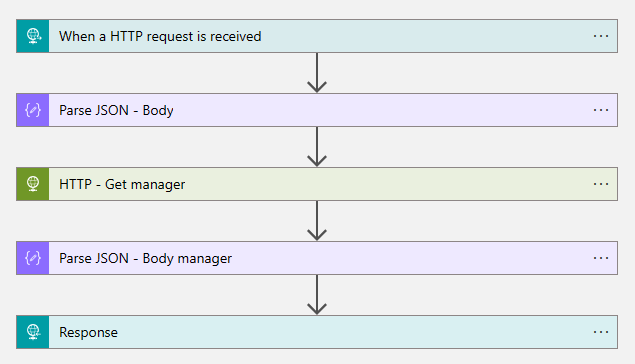

1. When a HTTP request is created
When user will signin to application, this flow will trigger.

    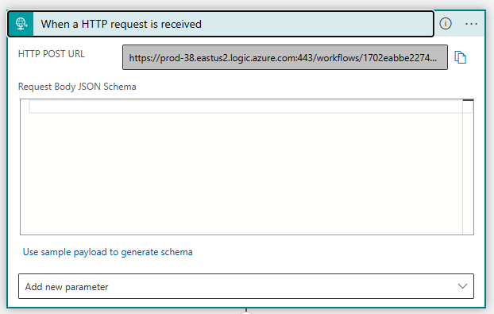

2. Parse JSON - Body
We need to parse the output to get user's id.

    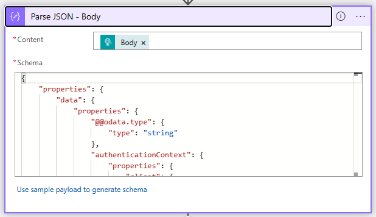

Here the sample:
`{ "properties": { "data": { "properties": { "@@odata.type": { "type": "string" }, "authenticationContext": { "properties": { "client": { "properties": { "ip": { "type": "string" }, "locale": { "type": "string" }, "market": { "type": "string" } }, "type": "object" }, "clientServicePrincipal": { "properties": { "appDisplayName": { "type": "string" }, "appId": { "type": "string" }, "displayName": { "type": "string" }, "id": { "type": "string" } }, "type": "object" }, "correlationId": { "type": "string" }, "protocol": { "type": "string" }, "resourceServicePrincipal": { "properties": { "appDisplayName": { "type": "string" }, "appId": { "type": "string" }, "displayName": { "type": "string" }, "id": { "type": "string" } }, "type": "object" }, "user": { "properties": { "companyName": { "type": "string" }, "createdDateTime": { "type": "string" }, "displayName": { "type": "string" }, "givenName": { "type": "string" }, "id": { "type": "string" }, "mail": { "type": "string" }, "preferredLanguage": { "type": "string" }, "surname": { "type": "string" }, "userPrincipalName": { "type": "string" }, "userType": { "type": "string" } }, "type": "object" } }, "type": "object" }, "authenticationEventListenerId": { "type": "string" }, "customAuthenticationExtensionId": { "type": "string" }, "tenantId": { "type": "string" } }, "type": "object" }, "source": { "type": "string" }, "type": { "type": "string" } }, "type": "object" }`

3. HTTP - Get manager
We get manager of user based on his id.

    

4. Parse JSON - Body manager
We need to parse the output to get user's id.

    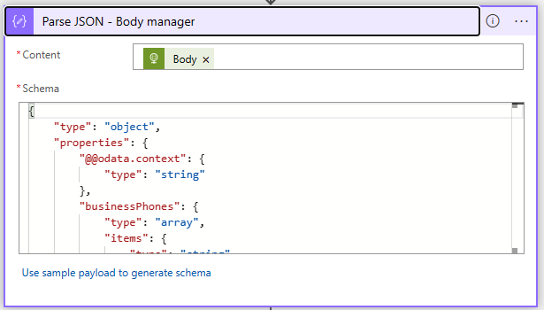

Here the sample:
`{ "type": "object", "properties": { "@@odata.context": { "type": "string" }, "businessPhones": { "type": "array", "items": { "type": "string" } }, "displayName": { "type": "string" }, "givenName": { "type": "string" }, "jobTitle": { "type": "string" }, "mail": { "type": "string" }, "mobilePhone": {}, "officeLocation": {}, "preferredLanguage": { "type": "string" }, "surname": { "type": "string" }, "userPrincipalName": { "type": "string" }, "id": { "type": "string" }, "manager": { "type": "object", "properties": { "@@odata.type": { "type": "string" }, "id": { "type": "string" }, "deletedDateTime": {}, "accountEnabled": { "type": "boolean" }, "ageGroup": {}, "businessPhones": { "type": "array" }, "city": {}, "companyName": {}, "consentProvidedForMinor": {}, "country": {}, "createdDateTime": { "type": "string" }, "creationType": {}, "department": {}, "displayName": { "type": "string" }, "employeeId": {}, "employeeHireDate": {}, "employeeLeaveDateTime": {}, "employeeType": {}, "externalUserState": {}, "externalUserStateChangeDateTime": {}, "faxNumber": {}, "givenName": { "type": "string" }, "isLicenseReconciliationNeeded": { "type": "boolean" }, "jobTitle": {}, "legalAgeGroupClassification": {}, "mail": { "type": "string" }, "mailNickname": { "type": "string" }, "mobilePhone": {}, "onPremisesDistinguishedName": {}, "onPremisesDomainName": {}, "onPremisesImmutableId": {}, "onPremisesLastSyncDateTime": {}, "onPremisesSecurityIdentifier": {}, "onPremisesSamAccountName": {}, "onPremisesSyncEnabled": {}, "onPremisesUserPrincipalName": {}, "otherMails": { "type": "array" }, "passwordPolicies": {}, "officeLocation": {}, "postalCode": {}, "preferredDataLocation": {}, "preferredLanguage": {}, "proxyAddresses": { "type": "array", "items": { "type": "string" } }, "refreshTokensValidFromDateTime": { "type": "string" }, "imAddresses": { "type": "array", "items": { "type": "string" } }, "isResourceAccount": {}, "showInAddressList": {}, "securityIdentifier": { "type": "string" }, "signInSessionsValidFromDateTime": { "type": "string" }, "state": {}, "streetAddress": {}, "surname": { "type": "string" }, "usageLocation": { "type": "string" }, "userPrincipalName": { "type": "string" }, "userType": { "type": "string" }, "employeeOrgData": {}, "passwordProfile": {}, "assignedLicenses": { "type": "array", "items": { "type": "object", "properties": { "disabledPlans": { "type": "array" }, "skuId": { "type": "string" } }, "required": [ "disabledPlans", "skuId" ] } }, "assignedPlans": { "type": "array", "items": { "type": "object", "properties": { "assignedDateTime": { "type": "string" }, "capabilityStatus": { "type": "string" }, "service": { "type": "string" }, "servicePlanId": { "type": "string" } }, "required": [ "assignedDateTime", "capabilityStatus", "service", "servicePlanId" ] } }, "authorizationInfo": { "type": "object", "properties": { "certificateUserIds": { "type": "array" } } }, "identities": { "type": "array", "items": { "type": "object", "properties": { "signInType": { "type": "string" }, "issuer": { "type": "string" }, "issuerAssignedId": { "type": "string" } }, "required": [ "signInType", "issuer", "issuerAssignedId" ] } }, "onPremisesProvisioningErrors": { "type": "array" }, "onPremisesExtensionAttributes": { "type": "object", "properties": { "extensionAttribute1": {}, "extensionAttribute2": {}, "extensionAttribute3": {}, "extensionAttribute4": {}, "extensionAttribute5": {}, "extensionAttribute6": {}, "extensionAttribute7": {}, "extensionAttribute8": {}, "extensionAttribute9": {}, "extensionAttribute10": {}, "extensionAttribute11": {}, "extensionAttribute12": {}, "extensionAttribute13": {}, "extensionAttribute14": {}, "extensionAttribute15": {} } }, "provisionedPlans": { "type": "array", "items": { "type": "object", "properties": { "capabilityStatus": { "type": "string" }, "provisioningStatus": { "type": "string" }, "service": { "type": "string" } }, "required": [ "capabilityStatus", "provisioningStatus", "service" ] } }, "serviceProvisioningErrors": { "type": "array" } } } } }`

5. Response
This response will send to Entra ID. We define the claim and the value.

    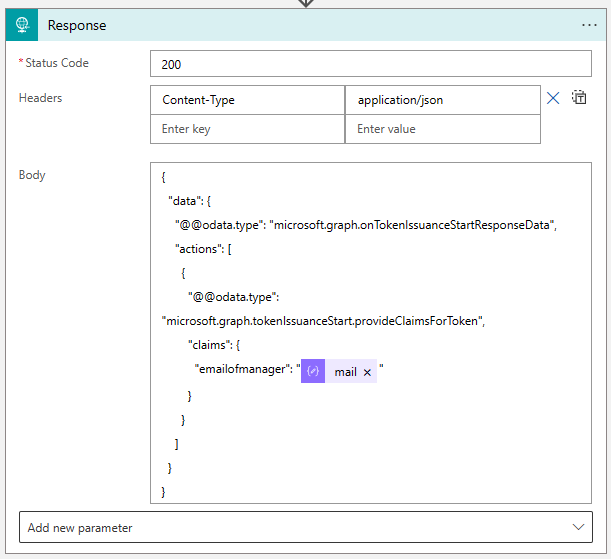

Copy the workflow URL to next step.

    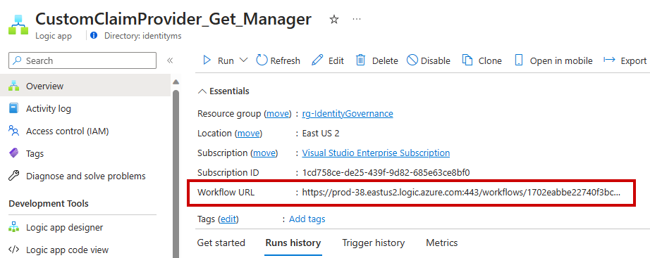

# Custom Authentication extensions (preview)
Keep in mind that is currently in preview.
1. Create a new extension.

    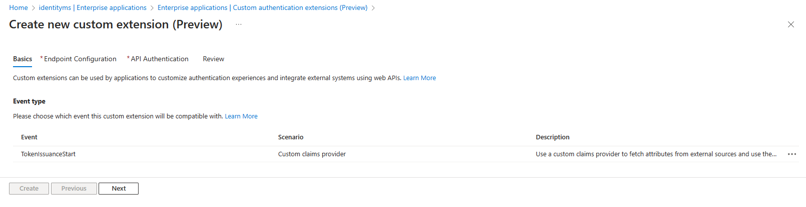

2. Modify the workflow URL
Remove all things after **run** and then paste to **Target URL** field.
Don't forget to add a description for other administrators.
- Before
https://......./triggers/manual/paths/invoke?api-version=2016-10-01&sp=%2Ftriggers%2Fmanual%2Frun&sv=1.0&sig=-oVEm0KFMB5JmDIQ_RZNgjLO_GFLGPofbfoJdQ5mto4
- After
https://......./triggers/manual/paths/invoke?api-version=2016-10-01&sp=%2Ftriggers%2Fmanual%2Frun

    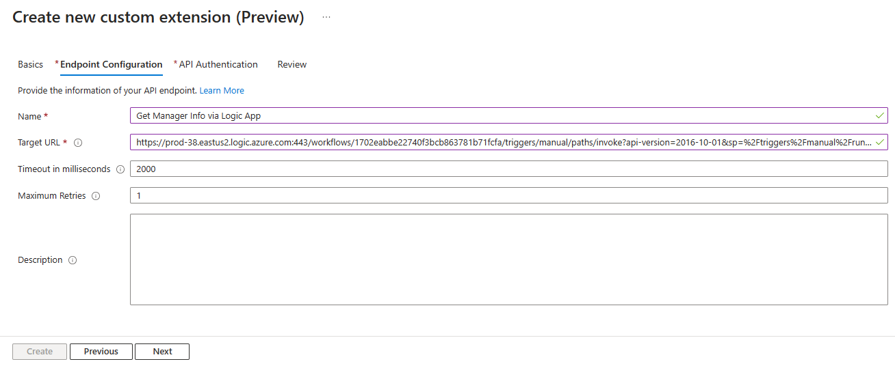

3. API Authentication
Create a new application and click on **Grant permissions**.

    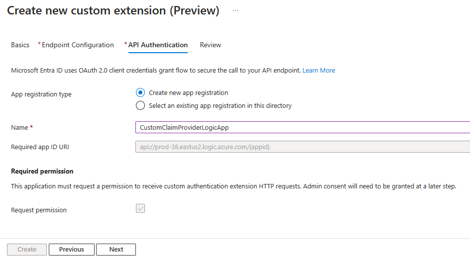

# Go back to your application
Now, we need to add our Custom Authentication Extensions in our application.
1. 

    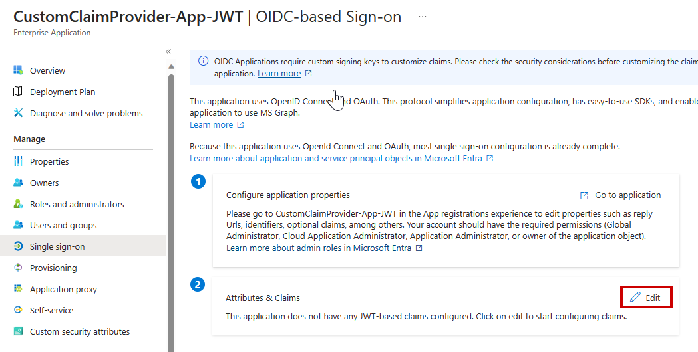

2. Configure custom claim provider.

    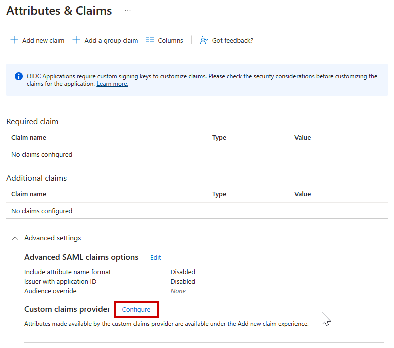

3. Select your Custom Authentication Extensions.

    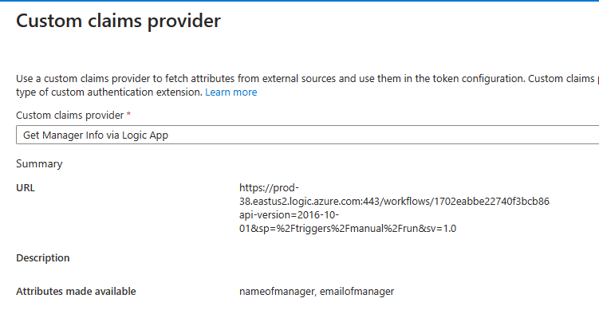

4. Add a new claim
Define a name and select claim from Custom Claim Provider.

    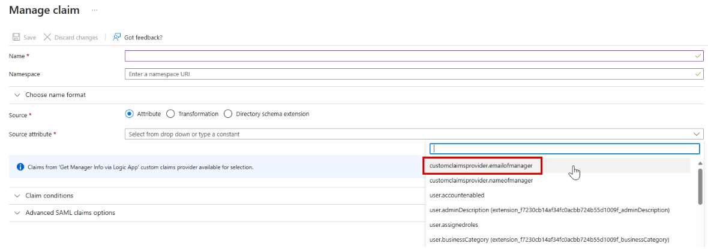

5. Validate 
You should see something like this.

    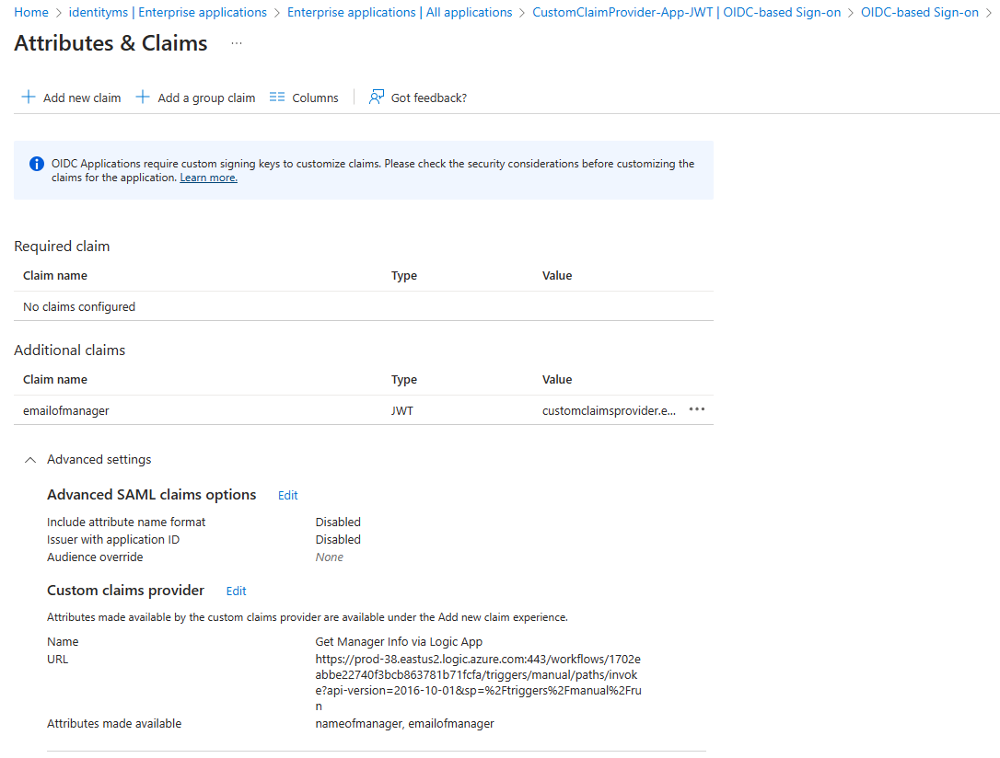

# Secure your Logic App
Go to ** Authorization** on your Logic App, add a policy.
- Issuer: https://login.microsoftonline.com/tenantid/v2.0
- Audience: <clientid of "CustomClaimProviderLogicApp"
- azp: 99045fe1-7639-4a75-9d4a-577b6ca3810f (this id is the same for all tenants)

    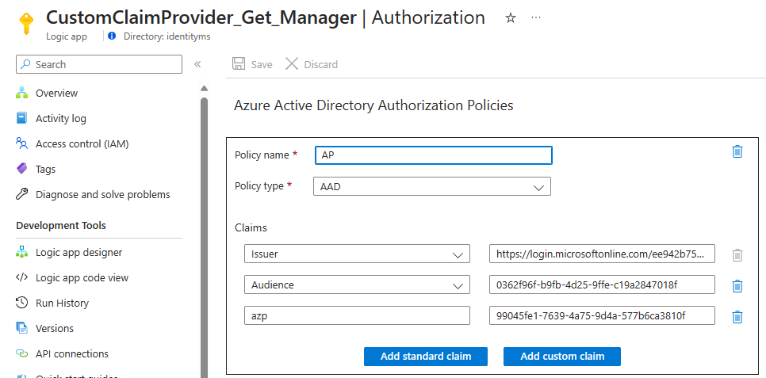

# Troubleshooting
To simulate an user authentication on your application, you can use this link. Replace before these values:
- tenantid
- clientid (it's clientid of your application)
This link will get an ID token.

`https://login.microsoftonline.com/<tenantid>/oauth2/v2.0/authorize?client_id=<clientid>&redirect_uri=https%3A%2F%2Fjwt.ms%2F&scope=openid&nonce=defaultNonce&response_type=id_token`

## AADSTS50146

    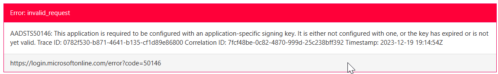

Validate that manifest of your application (JWT) are correct:
- "acceptMappedClaims": true,
- "accessTokenAcceptedVersion": 2,

## AADSTS1100001

    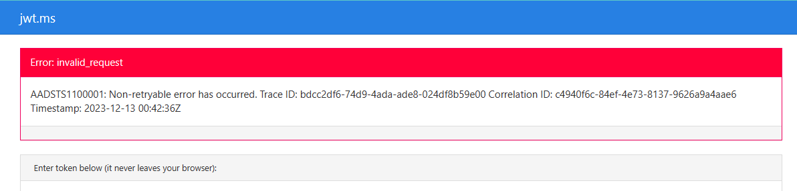

To get more informations, go to **Authentication Events** on sign-in logs.
### HTTP 400

    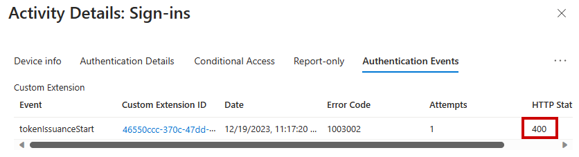

Validate that "When a HTTP request is received" step doesn't have a parameter.

### HTTP 403

    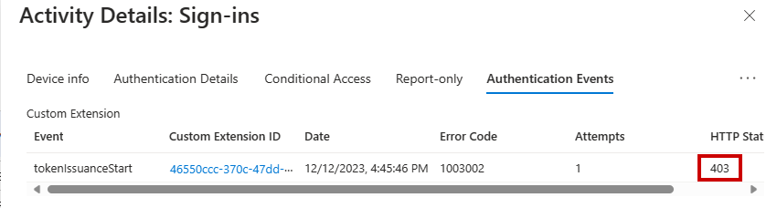

➡️Validate the EndPoint in Authorization Policy of Logic App is correct.
`https://login.microsoftonline.com/tenantid/v2.0`

➡️Validate manifest of App for Logic App
- "acceptMappedClaims": true,
- "accessTokenAcceptedVersion": 2,

### HTTP 502

    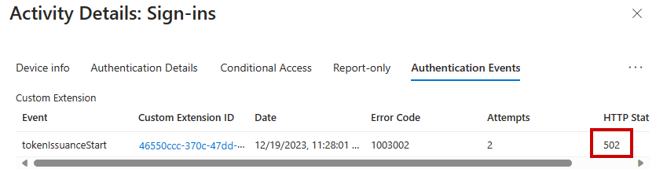

### Error Code 1003009

    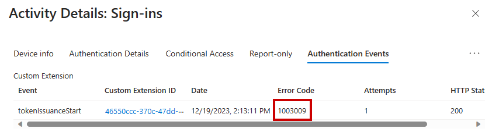

➡️Validate the content of the response in your Logic App.

# Credit

Mathias Dumont

Thank you also to my peers, Pierre Audonnet and Tanya Shattuck.

