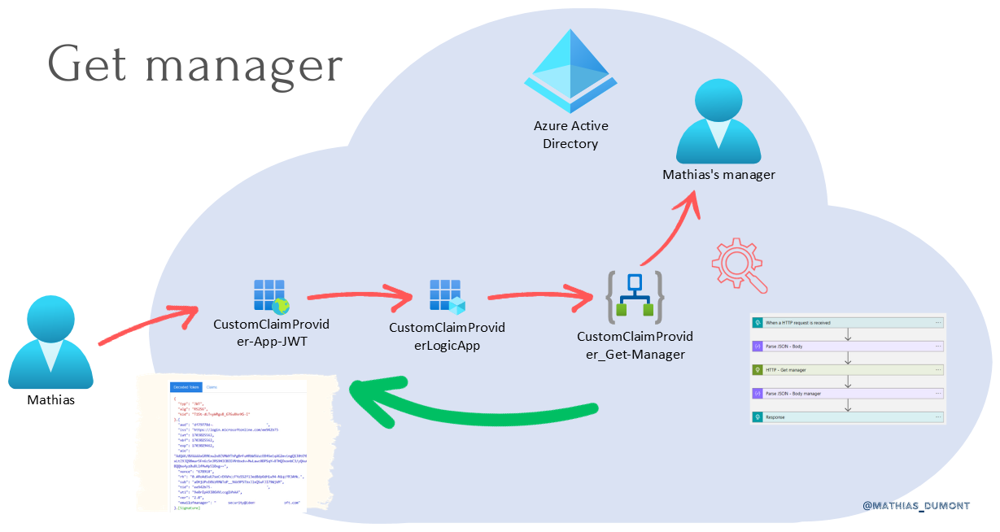
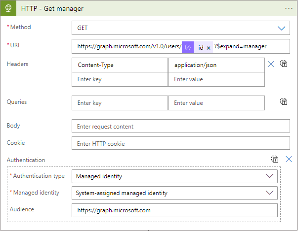
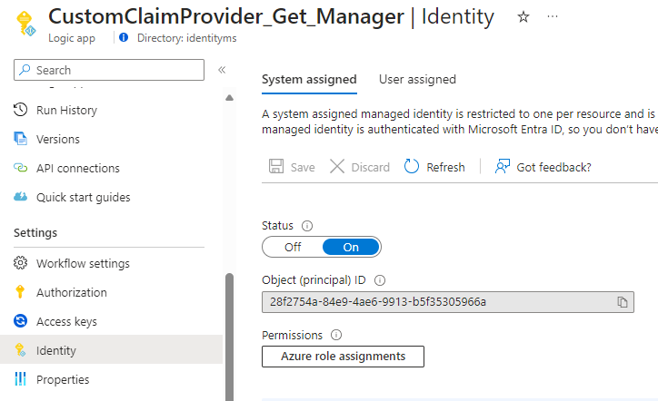

# Table of Contents
- [Introduction](#introduction)
- [Architecture Schema](#architecture-schema)
- [My application (JWT)](#application-jwt)
    - [Register an application](#register-application-named-customclaimprovider-app-jwt)
    - [Configuration](#configuration-of-this-application)
    - [Test](#test-your-application)
- [Logic Apps](#logic-app)
    - [Flow - Get manager](#flow---get-manager)
    - [Flow - Get type of identity from in Custom Security Attribute](#flow---get-type-of-identity-from-custom-security-attribute)
- [Custom Authentication Extensions](#custom-authentication-extensions-preview)
- [Go back to your app](#go-back-to-your-application)
- [Secure your Logic App](#secure-your-logic-app)
- [Troubleshooting](#troubleshooting)
    - [AADSTS50146](#aadsts50146)
    - [AADSTS1100001](#aadsts1100001)


# Introduction
I often get questions such as, *“How can I add some information as claim?”* or *“My information is not in Entra ID, what should I do to include this information in my token?”* This example can be used to address some scenarios such as:
1. I need to get email of manager of user in his token. Based on this information, in my application I will be able to validate his access of this user is authorized or not.
2. I need to store a sensitive information in Entra ID and inject it in his token.

Thank to copilot for grammar correction.

# Architecture schema


# Application JWT
To read the content of token, you have different tools depending of type of token (Claims X-Ray, [JWT Decoder](https://adfshelp.microsoft.com/JwtDecoder/GetToken) or [JWT.io](https://jwt.io)) but in this example, I will use [jwt.ms](https://jwt.io).

The first step consist of creating an application named **CustomClaimProvider-App-JWT**. With this application, I will be able to view the content of my tokens.
I recommend to create it because each time you want to deploy an application, you should validate informations presented in the token. It will be helpful during your day-to-day.

## Register application named CustomClaimProvider-App-JWT
1. Define a name
2. Select Single Tenant. In most of case, you don't need a Multitenant app. To understand the difference and risk, [follow this link](https://merill.net/2023/04/azure-ad-multi-tenant-app-vs-single-tenant-app/).
<p align="center" width="100%">
    
</p>

3. Select type of application: web
4. Define the URL of jwt.ms website.

## Configuration of this application
#### "Enterprise Application" menu
1. Enable **Enabled for users to sign-in**
2. Disable **Assignment required**. This will allow admins and developers to use this application. If some users have some issues, you can ask them to use this application to see their claims and trouble shoot why they have an issue with your application.
3. Disable **Visible to users** It's not necessary to offer this application through [myapplication](https://myapps.microsoft.com) portal.
<p align="center" width="100%">
    
</p>

#### "App Registration" menu
1. Select ID Tokens
<p align="center" width="100%">
    
</p>

2. Manifest: modify both value.
<p align="center" width="100%">
    
</p>

## Test your application
Before testing, you need to get some information:
1. Client ID
2. Tenant ID
<p align="center" width="100%">
    
</p>

Then, replace values (*tenantid* and *clientid*) by your own values.

`https://login.microsoftonline.com/<tenantid>/oauth2/v2.0/authorize?client_id=<clientid>&redirect_uri=https%3A%2F%2Fjwt.ms%2F&scope=openid&nonce=defaultNonce&response_type=id_token`

Open a tab in your browser and paste the link. You should see your token decoded.
<p align="center" width="100%">
    
</p>

# Logic App
Before creating your Logic App, you have to decide which type you want to use. From cost perspective, in this example, I will use Consumption (less expensive).

## Flow - Get manager
Remember that in my scenario 1, I want to get manager of user and add it into the user token.
<p align="center" width="100%">
    
</p>

1. When a HTTP request is created

When user will signin to application, this flow will trigger.
<p align="center" width="100%">
    
</p>

2. Parse JSON - Body

You need to parse the output of **When a HTTP request is received** action to get user's id.
<p align="center" width="100%">
    
</p>

Here the sample:

```xml
`{ "properties": { "data": { "properties": { "@@odata.type": { "type": "string" }, "authenticationContext": { "properties": { "client": { "properties": { "ip": { "type": "string" }, "locale": { "type": "string" }, "market": { "type": "string" } }, "type": "object" }, "clientServicePrincipal": { "properties": { "appDisplayName": { "type": "string" }, "appId": { "type": "string" }, "displayName": { "type": "string" }, "id": { "type": "string" } }, "type": "object" }, "correlationId": { "type": "string" }, "protocol": { "type": "string" }, "resourceServicePrincipal": { "properties": { "appDisplayName": { "type": "string" }, "appId": { "type": "string" }, "displayName": { "type": "string" }, "id": { "type": "string" } }, "type": "object" }, "user": { "properties": { "companyName": { "type": "string" }, "createdDateTime": { "type": "string" }, "displayName": { "type": "string" }, "givenName": { "type": "string" }, "id": { "type": "string" }, "mail": { "type": "string" }, "preferredLanguage": { "type": "string" }, "surname": { "type": "string" }, "userPrincipalName": { "type": "string" }, "userType": { "type": "string" } }, "type": "object" } }, "type": "object" }, "authenticationEventListenerId": { "type": "string" }, "customAuthenticationExtensionId": { "type": "string" }, "tenantId": { "type": "string" } }, "type": "object" }, "source": { "type": "string" }, "type": { "type": "string" } }, "type": "object" }
```

3. HTTP - Get manager

You get manager of user based on his id. Be sure you selected id of user Authentication Context from **Parse_Json_-_Body** action.
<p align="center" width="100%">
    
</p>

As you can see, here I selected "Managed Identity" and not a Service Principal.
Go to **Identity** and enable **System assigned**
<p align="center" width="100%">
    
</p>
Then, you need to assign permission to this MI to read user information.
To do that, you can use this script:

```powershell
$TenantID = "xxxxxx"
$GraphAppId = "00000003-0000-0000-c000-000000000000"
$DisplayNameMI = "CustomClaimProvider_Get_Manager"
$GraphPermission = "Directory.Read.All"

Connect-MgGraph -Scopes Application.Read.All,AppRoleAssignment.ReadWrite.All

$IdMI = Get-MgServicePrincipal -Filter "DisplayName eq '$DisplayNameMI'"

## Get assigned roles
Get-MgServicePrincipalAppRoleAssignment -ServicePrincipalId $IdMI.Id

## Get Graph roles
$GraphServicePrincipal = Get-MgServicePrincipal -Filter "appId eq '$GraphAppId'"
$AppRole = $GraphServicePrincipal.AppRoles | Where-Object {$_.Value -eq $GraphPermission -and $_.AllowedMemberTypes -contains "Application"}

$AppRole

$params = @{
	principalId = $IdMI.Id
	resourceId = $GraphAppId
    appRoleId = $($AppRole.Id)
}

## Add permission to Managed Identity
New-MgServicePrincipalAppRoleAssignment -ServicePrincipalId $IdMI.Id -ResourceId $GraphServicePrincipal.Id -PrincipalId $IdMI.Id -AppRoleId $AppRole.Id

## Get assigned roles
Get-MgServicePrincipalAppRoleAssignment -ServicePrincipalId $IdMI.Id
```

4. Parse JSON - Body manager

You need to parse the output of **HTTP - Get manager** action to get user's id.
<p align="center" width="100%">
    
</p>

Here the sample:

```xml
{ "type": "object", "properties": { "@@odata.context": { "type": "string" }, "businessPhones": { "type": "array", "items": { "type": "string" } }, "displayName": { "type": "string" }, "givenName": { "type": "string" }, "jobTitle": { "type": "string" }, "mail": { "type": "string" }, "mobilePhone": {}, "officeLocation": {}, "preferredLanguage": { "type": "string" }, "surname": { "type": "string" }, "userPrincipalName": { "type": "string" }, "id": { "type": "string" }, "manager": { "type": "object", "properties": { "@@odata.type": { "type": "string" }, "id": { "type": "string" }, "deletedDateTime": {}, "accountEnabled": { "type": "boolean" }, "ageGroup": {}, "businessPhones": { "type": "array" }, "city": {}, "companyName": {}, "consentProvidedForMinor": {}, "country": {}, "createdDateTime": { "type": "string" }, "creationType": {}, "department": {}, "displayName": { "type": "string" }, "employeeId": {}, "employeeHireDate": {}, "employeeLeaveDateTime": {}, "employeeType": {}, "externalUserState": {}, "externalUserStateChangeDateTime": {}, "faxNumber": {}, "givenName": { "type": "string" }, "isLicenseReconciliationNeeded": { "type": "boolean" }, "jobTitle": {}, "legalAgeGroupClassification": {}, "mail": { "type": "string" }, "mailNickname": { "type": "string" }, "mobilePhone": {}, "onPremisesDistinguishedName": {}, "onPremisesDomainName": {}, "onPremisesImmutableId": {}, "onPremisesLastSyncDateTime": {}, "onPremisesSecurityIdentifier": {}, "onPremisesSamAccountName": {}, "onPremisesSyncEnabled": {}, "onPremisesUserPrincipalName": {}, "otherMails": { "type": "array" }, "passwordPolicies": {}, "officeLocation": {}, "postalCode": {}, "preferredDataLocation": {}, "preferredLanguage": {}, "proxyAddresses": { "type": "array", "items": { "type": "string" } }, "refreshTokensValidFromDateTime": { "type": "string" }, "imAddresses": { "type": "array", "items": { "type": "string" } }, "isResourceAccount": {}, "showInAddressList": {}, "securityIdentifier": { "type": "string" }, "signInSessionsValidFromDateTime": { "type": "string" }, "state": {}, "streetAddress": {}, "surname": { "type": "string" }, "usageLocation": { "type": "string" }, "userPrincipalName": { "type": "string" }, "userType": { "type": "string" }, "employeeOrgData": {}, "passwordProfile": {}, "assignedLicenses": { "type": "array", "items": { "type": "object", "properties": { "disabledPlans": { "type": "array" }, "skuId": { "type": "string" } }, "required": [ "disabledPlans", "skuId" ] } }, "assignedPlans": { "type": "array", "items": { "type": "object", "properties": { "assignedDateTime": { "type": "string" }, "capabilityStatus": { "type": "string" }, "service": { "type": "string" }, "servicePlanId": { "type": "string" } }, "required": [ "assignedDateTime", "capabilityStatus", "service", "servicePlanId" ] } }, "authorizationInfo": { "type": "object", "properties": { "certificateUserIds": { "type": "array" } } }, "identities": { "type": "array", "items": { "type": "object", "properties": { "signInType": { "type": "string" }, "issuer": { "type": "string" }, "issuerAssignedId": { "type": "string" } }, "required": [ "signInType", "issuer", "issuerAssignedId" ] } }, "onPremisesProvisioningErrors": { "type": "array" }, "onPremisesExtensionAttributes": { "type": "object", "properties": { "extensionAttribute1": {}, "extensionAttribute2": {}, "extensionAttribute3": {}, "extensionAttribute4": {}, "extensionAttribute5": {}, "extensionAttribute6": {}, "extensionAttribute7": {}, "extensionAttribute8": {}, "extensionAttribute9": {}, "extensionAttribute10": {}, "extensionAttribute11": {}, "extensionAttribute12": {}, "extensionAttribute13": {}, "extensionAttribute14": {}, "extensionAttribute15": {} } }, "provisionedPlans": { "type": "array", "items": { "type": "object", "properties": { "capabilityStatus": { "type": "string" }, "provisioningStatus": { "type": "string" }, "service": { "type": "string" } }, "required": [ "capabilityStatus", "provisioningStatus", "service" ] } }, "serviceProvisioningErrors": { "type": "array" } } } } }
```

5. Response

This response will send to Entra ID. Define the claim and the value.
<p align="center" width="100%">
    
</p>

Copy the workflow URL to next step.
<p align="center" width="100%">
    
</p>

## Flow - Get type of identity from Custom Security Attribute
In this scenario 2, I store the type of identity (1 = employe, 2 = externe, 3 = dev, 4 = admin, 5 = svc, 6 = VIP) in a custom security attribute. The reason is simple. I don't want admins with user or group or other role be able to modify this value on identity. Only my high privileged admins and ServicePrincipal of my IGA solution are Attribute Assignement Administrator.
<p align="center" width="100%">
    
</p>

Here are my set and my Custom Security Attributes
<p align="center" width="100%">
    
</p>


Full flow
<p align="center" width="100%">
    
</p>

1. When a HTTP request is created

When user will signin to application, this flow will trigger.
<p align="center" width="100%">
    
</p>

2. Parse JSON - Body

You need to parse the output of **When a HTTP request is received** action to get user's id.
<p align="center" width="100%">
    
</p>

Here the sample:

```xml
`{
    "type": "object",
    "properties": {
        "type": {
            "type": "string"
        },
        "source": {
            "type": "string"
        },
        "data": {
            "type": "object",
            "properties": {
                "@@odata.type": {
                    "type": "string"
                },
                "tenantId": {
                    "type": "string"
                },
                "authenticationEventListenerId": {
                    "type": "string"
                },
                "customAuthenticationExtensionId": {
                    "type": "string"
                },
                "authenticationContext": {
                    "type": "object",
                    "properties": {
                        "correlationId": {
                            "type": "string"
                        },
                        "client": {
                            "type": "object",
                            "properties": {
                                "ip": {
                                    "type": "string"
                                },
                                "locale": {
                                    "type": "string"
                                },
                                "market": {
                                    "type": "string"
                                }
                            }
                        },
                        "protocol": {
                            "type": "string"
                        },
                        "clientServicePrincipal": {
                            "type": "object",
                            "properties": {
                                "id": {
                                    "type": "string"
                                },
                                "appId": {
                                    "type": "string"
                                },
                                "appDisplayName": {
                                    "type": "string"
                                },
                                "displayName": {
                                    "type": "string"
                                }
                            }
                        },
                        "resourceServicePrincipal": {
                            "type": "object",
                            "properties": {
                                "id": {
                                    "type": "string"
                                },
                                "appId": {
                                    "type": "string"
                                },
                                "appDisplayName": {
                                    "type": "string"
                                },
                                "displayName": {
                                    "type": "string"
                                }
                            }
                        },
                        "user": {
                            "type": "object",
                            "properties": {
                                "companyName": {
                                    "type": "string"
                                },
                                "createdDateTime": {
                                    "type": "string"
                                },
                                "displayName": {
                                    "type": "string"
                                },
                                "givenName": {
                                    "type": "string"
                                },
                                "id": {
                                    "type": "string"
                                },
                                "mail": {
                                    "type": "string"
                                },
                                "preferredLanguage": {
                                    "type": "string"
                                },
                                "surname": {
                                    "type": "string"
                                },
                                "userPrincipalName": {
                                    "type": "string"
                                },
                                "userType": {
                                    "type": "string"
                                }
                            }
                        }
                    }
                }
            }
        }
    }
}
```

3. HTTP - Get type of identity

You get type of user based on his id. Be sure you selected id of user Authentication Context from **Parse_Json_-_Body** action.
<p align="center" width="100%">
    
</p>

As you can see, here I selected "Managed Identity" and not a Service Principal.
Got to **Identity** and enable **System assigned**
<p align="center" width="100%">
    
</p>
Then, you need to assign permission to this MI to read user information.
To do that, you can use this script:

```powershell
$TenantID = "xxxxxx"
$GraphAppId = "00000003-0000-0000-c000-000000000000"
$DisplayNameMI = "CustomClaimProvider_customsecattr"
$GraphPermissions = @('CustomSecAttributeAssignment.Read.All','User.Read.All')

Connect-MgGraph -Scopes Application.Read.All,AppRoleAssignment.ReadWrite.All

$IdMI = Get-MgServicePrincipal -Filter "DisplayName eq '$DisplayNameMI'"

## Get assigned roles
Get-MgServicePrincipalAppRoleAssignment -ServicePrincipalId $IdMI.Id

ForEach ($Permission in $GraphPermissions) {
    ## Get Graph roles
    $GraphServicePrincipal = Get-MgServicePrincipal -Filter "appId eq '$GraphAppId'"
    $AppRole = $GraphServicePrincipal.AppRoles | Where-Object {$_.Value -eq $Permission -and $_.AllowedMemberTypes -contains "Application"}

    $AppRole

    $params = @{
        principalId = $IdMI.Id
        resourceId = $GraphAppId
        appRoleId = $($AppRole.Id)
    }

    ## Add permission to Managed Identity
    New-MgServicePrincipalAppRoleAssignment -ServicePrincipalId $IdMI.Id -ResourceId $GraphServicePrincipal.Id -PrincipalId $IdMI.Id -AppRoleId $AppRole.Id
}

## Get assigned roles
Get-MgServicePrincipalAppRoleAssignment -ServicePrincipalId $IdMI.Id
```

4. Parse JSON - Body manager

You need to parse the output of **HTTP - Get CSA** action to get user's id.
<p align="center" width="100%">
    
</p>

Here the sample:

```xml
{
    "type": "object",
    "properties": {
        "@@odata.context": {
            "type": "string"
        },
        "customSecurityAttributes": {
            "type": "object",
            "properties": {
                "TrustedLevel": {
                    "type": "object",
                    "properties": {
                        "@@odata.type": {
                            "type": "string"
                        },
                        "Identity": {
                            "type": "string"
                        },
                        "IdentityType": {
                            "type": "string"
                        }
                    }
                }
            }
        }
    }
}
```

5. Response

This response will send to Entra ID. Define the claim and the value.
<p align="center" width="100%">
    
</p>

Copy the workflow URL to next step.
<p align="center" width="100%">
    
</p>


# Custom Authentication extensions
1. Create a new extension.
<p align="center" width="100%">
    
</p>

2. Modify the workflow URL

Remove all things after **run** and then paste to **Target URL** field.
Don't forget to add a description for other administrators.

👉Before
`https://......./triggers/manual/paths/invoke?api-version=2016-10-01&sp=%2Ftriggers%2Fmanual%2Frun&sv=1.0&sig=-oVEm0KFMB5JmDIQ_RZNgjLO_GFLGPofbfoJdQ5mto4`

👉After
`https://......./triggers/manual/paths/invoke?api-version=2016-10-01&sp=%2Ftriggers%2Fmanual%2Frun`
<p align="center" width="100%">
    
</p>

3. API Authentication

Create a new application and click on **Grant permissions**.
<p align="center" width="100%">
    
</p>

# Go back to your application
Now, you need to add our Custom Authentication Extensions in our application.

1. Edit **Attributes & Claims**
<p align="center" width="100%">
    
</p>

2. Configure custom claim provider.
<p align="center" width="100%">
    
</p>

3. Select your Custom Authentication Extensions
<p align="center" width="100%">
    
</p>

4. Add a new claim

Define a name and select claim from Custom Claim Provider.
<p align="center" width="100%">
    
</p>

5. Validate

You should see something like this.
<p align="center" width="100%">
    
</p>

# Secure your Logic App
Go to **Authorization** on your Logic App, add a policy.
- Issuer: https://login.microsoftonline.com/tenantid/v2.0
- Audience: <clientid of "CustomClaimProviderLogicApp">
- azp: 99045fe1-7639-4a75-9d4a-577b6ca3810f (this id is the same for all tenants)
<p align="center" width="100%">
    
</p>


# Here we go
Now, email of my manager is included.
<p align="center" width="100%">
    
</p>

And here, the type of identity
<p align="center" width="100%">
    
</p>


# Troubleshooting
To simulate a user authentication on your application, you can use this link. Replace before these values:
- tenantid
- clientid (clientid of your application)

This link will get an ID token.

`https://login.microsoftonline.com/<tenantid>/oauth2/v2.0/authorize?client_id=<clientid>&redirect_uri=https%3A%2F%2Fjwt.ms%2F&scope=openid&nonce=defaultNonce&response_type=id_token`


## AADSTS50146
<p align="center" width="100%">
    
</p>

➡️Ensure that manifest of your application (JWT) is correct:
- "acceptMappedClaims": true,
- "accessTokenAcceptedVersion": 2,


## AADSTS1100001
<p align="center" width="100%">
    
</p>

To get more informations, go to **Authentication Events** on sign-in logs.
### HTTP 400
<p align="center" width="100%">
    
</p>
➡️Validate that "When a HTTP request is received" step doesn't have a parameter.

### HTTP 403
<p align="center" width="100%">
    
</p>

➡️Validate the EndPoint in Authorization Policy of Logic App is correct.

`https://login.microsoftonline.com/tenantid/v2.0`

➡️Validate manifest of App for Logic App
- "acceptMappedClaims": true,
- "accessTokenAcceptedVersion": 2,


### HTTP 502
<p align="center" width="100%">
    
</p>


### Error Code 1003009
<p align="center" width="100%">
    
</p>
➡️Validate the content of the response in your Logic App.


# Disclaimers

This Sample Code is provided for the purpose of illustration only and is not intended to be used in a production environment.  THIS SAMPLE CODE AND ANY RELATED INFORMATION ARE PROVIDED "AS IS" WITHOUT WARRANTY OF ANY KIND, EITHER EXPRESSED OR IMPLIED, INCLUDING BUT NOT LIMITED TO THE IMPLIED WARRANTIES OF MERCHANTABILITY AND/OR FITNESS FOR A PARTICULAR PURPOSE.  We grant You a nonexclusive, royalty-free right to use and modify the Sample Code and to reproduce and distribute the object code form of the Sample Code, provided that You agree:

(i) to not use Our name, logo, or trademarks to market Your software product in which the Sample Code is embedded;

(ii) to include a valid copyright notice on Your software product in which the Sample Code is embedded;

 and (iii) to indemnify, hold harmless, and defend Us and Our suppliers from and against any claims or lawsuits, including attorneys' fees, that arise or result from the use or distribution of the Sample code.

This posting is provided "AS IS" with no warranties, and confers no rights. Use of included script samples are subject to the terms specified at https://www.microsoft.com/info/copyright.htm.

# Credit

Mathias Dumont

Thanks also to my peers, Pierre Audonnet and Tanya Shattuck.

